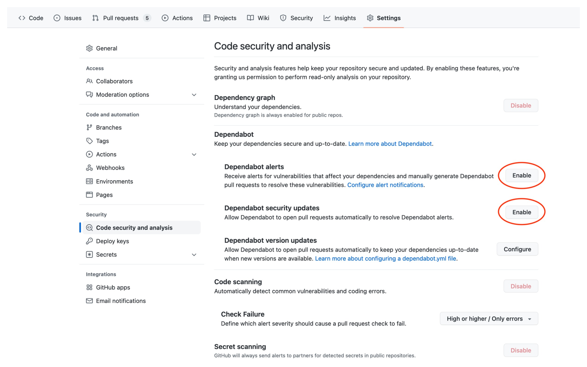

# Initial setup steps for new project repos

Below are common repo setup steps for new projects. These steps are recommendations but not required.

## General settings

In the project repo's `Settings > General`:

- Under "Features":
  - Enable/disable features that you want for your project. For example, turn off the Wiki if your project won't be using it.
- Under "Pull Requests":
  - Enable only the merge options your project should support. It's common to only support squash merging to keep the commit history clean.
  - Check "Always suggest updating pull request branches" to encourage pull requests to be updated when they deviate from `main`
  - Check "Automatically delete head branches" to automatically delete branches once they are merged into `main`

## Branch protections

[Branch protections](https://docs.github.com/en/repositories/configuring-branches-and-merges-in-your-repository/defining-the-mergeability-of-pull-requests/about-protected-branches) are a great way to enforce code quality and prevent accidental merges.

Typical branch protections for `main` include:

- Require a pull request before merging
- Require approvals (Minimum of 1)
- Require status checks to pass before merging

## Security settings

In the project repo's `Settings > Code security and analysis`:

- Enable "Dependabot alerts"
- Enable "Dependabot security updates"

